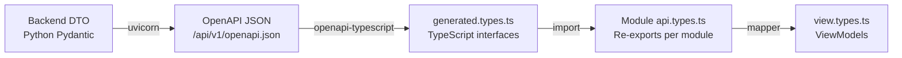

# Repository Strategy

> **Parent:** [Frontend Architecture](architecture/ARCHITECTURE.md)

---

## 1. Repository Layout: Sibling Repos

The Abren ERP platform uses **sibling repositories** under a shared parent directory. Each project is an independent Git repository with its own CI/CD pipeline, release cycle, and versioning.

```
abren-erp/                           # Parent directory (NOT a git repo)
├── abren-erp-api/                   # Backend (existing git repo)
│   ├── src/abren_erp_api/
│   │   └── modules/
│   │       ├── core/
│   │       ├── accounting/
│   │       ├── approvals/
│   │       ├── payment_requests/
│   │       ├── bank/
│   │       ├── reporting/
│   │       ├── webhooks/
│   │       └── system/
│   ├── docs/
│   ├── pyproject.toml
│   └── .git/
│
└── abren-erp-ui/                    # Frontend (new git repo)
    ├── src/
    │   ├── modules/
    │   │   ├── identity/            ← mirrors core
    │   │   ├── accounting/          ← mirrors accounting
    │   │   ├── workflows/           ← mirrors approvals
    │   │   ├── payment-requests/    ← mirrors payment_requests
    │   │   ├── banking/             ← mirrors bank
    │   │   ├── reporting/           ← mirrors reporting
    │   │   ├── webhooks/            ← mirrors webhooks
    │   │   └── system/              ← mirrors system
    │   └── core/
    ├── docs/
    ├── package.json
    ├── vite.config.ts
    └── .git/
```

---

## 2. Why Sibling Repos (Not Monorepo or Polyrepo)

| Criterion                     | Monorepo                             | Polyrepo                   | **Sibling Repos** ✅                  |
| ----------------------------- | ------------------------------------ | -------------------------- | ------------------------------------- |
| **Tooling complexity**        | Mixed Python + Node in one CI        | Totally separate           | Separate CI, but projects are nearby  |
| **Atomic commits**            | ✅ Cross-stack changes in one commit | ❌ Requires coordination   | ❌ Same trade-off, but locality helps |
| **Type safety**               | ✅ Shared types directly             | ❌ Manual sync, drift risk | ✅ OpenAPI codegen bridges the gap    |
| **IDE experience**            | Mixed language noise                 | Clean per-project          | ✅ Open both as workspace roots       |
| **Independent deploys**       | Requires careful CI config           | ✅ Natural                 | ✅ Natural                            |
| **Solo developer ergonomics** | Overhead from monorepo tooling       | Projects feel disconnected | ✅ Side-by-side, no tooling overhead  |

---

## 3. The Type Bridge: OpenAPI Codegen

The **single source of truth** for API types is the backend's OpenAPI specification. The frontend auto-generates TypeScript interfaces from it — no manual duplication.

### 3.1 Setup

```bash
# Install the generator
npm install -D openapi-typescript

# package.json script
{
  "scripts": {
    "generate-types": "openapi-typescript http://localhost:8000/api/v1/openapi.json -o src/core/api/generated.types.ts"
  }
}
```

### 3.2 How It Works



### 3.3 The Re-Export Pattern

Generated types go into one file. Each module re-exports only what it needs:

```typescript
// core/api/generated.types.ts — AUTO-GENERATED, never edit
export interface components {
  schemas: {
    PaymentRequestDTO: { ... }
    PaymentRequestCreateDTO: { ... }
    AccountCreate: { ... }
    JournalEntryCreate: { ... }
    // ... all backend schemas
  }
}

// modules/payment-requests/types/api.types.ts — Module-scoped re-export
import type { components } from '@/core/api/generated.types'

export type PaymentRequestDTO = components['schemas']['PaymentRequestDTO']
export type PaymentRequestCreateDTO = components['schemas']['PaymentRequestCreateDTO']
export type PaymentRequestPayDTO = components['schemas']['PaymentRequestPayDTO']
```

---

## 4. Development Workflow

### 4.1 Daily Workflow

```
Terminal 1 (Backend):
  cd abren-erp/abren-erp-api
  uv run uvicorn src.abren_erp_api.main:app --reload

Terminal 2 (Frontend):
  cd abren-erp/abren-erp-ui
  npm run dev
```

### 4.2 When Backend DTOs Change

```
1. Backend developer modifies a Pydantic DTO
2. Backend restarts (--reload picks up changes)
3. Frontend runs: npm run generate-types
4. TypeScript compiler highlights breaking changes
5. Fix only the affected mapper(s) — components untouched
```

### 4.3 IDE Workspace Setup

Open both projects as a multi-root workspace:

```jsonc
// abren-erp.code-workspace
{
  "folders": [
    { "path": "abren-erp-api", "name": "API (Backend)" },
    { "path": "abren-erp-ui", "name": "UI (Frontend)" },
  ],
}
```

---

## 5. Deployment Independence

| Concern           | Backend                           | Frontend                               |
| ----------------- | --------------------------------- | -------------------------------------- |
| **Deploy target** | VPS / Container (Uvicorn)         | CDN / Static hosting (Vercel, Netlify) |
| **Build trigger** | Push to `main` on `abren-erp-api` | Push to `main` on `abren-erp-ui`       |
| **Release cycle** | Independent                       | Independent                            |
| **Versioning**    | SemVer (Python)                   | SemVer (npm)                           |
| **API contract**  | OpenAPI spec is the contract      | Consumes the spec via codegen          |

### 5.1 Contract Stability Rule

> The backend **MUST NOT** introduce breaking changes to `/api/v1/*` without a deprecation cycle. If a breaking change is needed, create `/api/v2/*` endpoints. The frontend pins to a specific version prefix.

---

## 6. Cross-Referencing

Both projects reference each other's documentation but never each other's source code:

```
abren-erp-api/docs/architecture/ARCHITECTURE.md   ← Backend manifesto
abren-erp-ui/docs/architecture/ARCHITECTURE.md     ← Frontend manifesto (you are here)

abren-erp-api/docs/architecture/API_STRATEGY.md    ← Action-oriented endpoint rules
abren-erp-ui/docs/architecture/API_INTEGRATION.md  ← How UI consumes those endpoints
```
