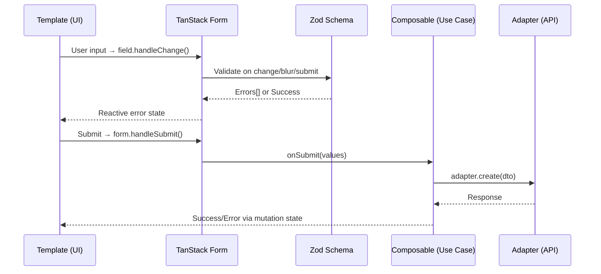

# Form Architecture

> **Parent:** [Frontend Architecture](ARCHITECTURE.md)
> **Technology:** TanStack Form + Zod + Custom Design System (`core/ui/`)

---

## 1. Philosophy

Forms are the **primary interaction surface** in an ERP. Every financial transaction, every configuration change, every approval — all flow through forms. Our form architecture enforces:

1. **Headless Logic:** TanStack Form manages state, validation lifecycles, and submission — the UI is decoupled.
2. **Schema-Driven Validation:** Zod schemas define validation rules as pure data. No imperative `if/else` in templates.
3. **Adapter Integration:** The `@tanstack/zod-form-adapter` bridges TanStack Form and Zod with zero glue code.

---

## 2. Data Flow



---

## 3. Form Composable Pattern

Each module's form logic lives in `application/composables/`. Forms follow the same Use Case Composable pattern as queries.

```typescript
// modules/business/finance/ap/payment-requests/application/composables/usePaymentRequestForm.ts
import { useForm } from '@tanstack/vue-form'
import { zodValidator } from '@tanstack/zod-form-adapter'
import { z } from 'zod'
import { useApiMutation } from '@/core/composables/useApiMutation'
import { paymentRequestAdapter } from '../../infrastructure/payment_request_adapter'

// ── Schema ────────────────────────────────────────────
const paymentRequestSchema = z.object({
  beneficiaryName: z.string().min(1, 'Beneficiary is required'),
  amount: z.number().positive('Amount must be positive'),
  currencyCode: z.string().length(3, 'Must be a valid ISO 4217 currency code'),
  description: z.string().max(500).optional(),
})

type PaymentRequestFormValues = z.infer<typeof paymentRequestSchema>

// ── Composable ────────────────────────────────────────
export function usePaymentRequestForm() {
  const { mutateAsync, isPending, error } = useApiMutation(
    (values: PaymentRequestFormValues) => paymentRequestAdapter.create(values),
  )

  const form = useForm({
    defaultValues: {
      beneficiaryName: '',
      amount: 0,
      currencyCode: 'ETB',
      description: '',
    } satisfies PaymentRequestFormValues,
    validatorAdapter: zodValidator(),
    validators: {
      onChange: paymentRequestSchema,
    },
    onSubmit: async ({ value }) => {
      await mutateAsync(value)
    },
  })

  return { form, isPending, error }
}
```

---

## 4. Template Integration

Pages import the form composable and bind fields declaratively using the design system components:

```vue
<script setup lang="ts">
import { usePaymentRequestForm } from '../../application/composables/usePaymentRequestForm'
import { Input } from '@/core/ui/input'
import { Label } from '@/core/ui/label'
import { Button } from '@/core/ui/button'

const { form, isPending } = usePaymentRequestForm()
</script>

<template>
  <form @submit.prevent.stop="form.handleSubmit()">
    <form.Field name="beneficiaryName" v-slot="{ field, state }">
      <div class="space-y-2">
        <Label for="beneficiary">Beneficiary</Label>
        <Input
          id="beneficiary"
          :model-value="field.state.value"
          @update:model-value="field.handleChange"
          @blur="field.handleBlur"
          :class="{ 'border-danger-500': state.meta.errors.length }"
        />
        <p v-if="state.meta.errors.length" class="text-sm text-danger-600">
          {{ state.meta.errors[0] }}
        </p>
      </div>
    </form.Field>

    <Button type="submit" :disabled="isPending">
      {{ isPending ? 'Submitting...' : 'Create Request' }}
    </Button>
  </form>
</template>
```

---

## 5. Validation Strategy

### 5.1 When to Validate

| Trigger | Use Case | Configuration |
|---|---|---|
| **On Change** | Real-time feedback for simple fields (text, numbers) | `validators: { onChange: schema }` |
| **On Blur** | Deferred validation for expensive checks or IDs | `validators: { onBlur: schema }` |
| **On Submit** | Final gate before mutation (always active) | `validators: { onSubmit: schema }` |

### 5.2 Error Display Rules

1. **Field-level errors** appear directly below the input, styled with `text-danger-600`.
2. **Form-level errors** (e.g., "Insufficient funds") appear in a banner above the submit button.
3. **Server errors** (from the mutation's `error` state) appear in a toast notification via the global error handler.

### 5.3 Zod Schema Conventions

- Schemas live **next to the composable** that uses them, not in `domain/`.
- Keep schemas as close to the API's expected payload shape as possible — the form IS the write-side DTO.
- Reuse shared validators from `core/` for cross-cutting concerns:

```typescript
// core/validation/validators.ts
export const isoDateString = z.string().regex(/^\d{4}-\d{2}-\d{2}$/, 'Must be YYYY-MM-DD')
export const positiveAmount = z.number().positive('Must be a positive amount')
```

---

## 6. Form Layout Patterns

### 6.1 Single-View Forms (Default)

Most ERP forms are single-view, rendered inside a **Context Drawer** (right-aligned, ~480px wide). This allows users to see the background data grid while editing.

### 6.2 Sectioned Forms

Complex records (e.g., Journal Entries with line items) use vertical sections with clear headings:

```
┌─────────────────────────────────┐
│ Header Info                      │
│ [Date]  [Reference]  [Memo]     │
├─────────────────────────────────┤
│ Line Items                       │
│ [Account] [Debit] [Credit]      │
│ [Account] [Debit] [Credit]      │
│              + Add Line          │
├─────────────────────────────────┤
│ Totals                           │
│ Debit: $X    Credit: $X         │
│ [Save Draft]  [Post]            │
└─────────────────────────────────┘
```

### 6.3 Multi-Step Wizards (Exceptional, Not Default)

Wizards are reserved for rare, complex configurations (e.g., Year-End Close, Initial Setup). When used:

- Display a progress indicator showing current step and total steps.
- Allow backward navigation without data loss.
- Validate each step's schema independently before advancing.

---

## 7. Rules

1. **No `v-model` directly on API data.** Forms always work on a local copy via TanStack Form's managed state.
2. **No validation logic in templates.** All rules live in Zod schemas.
3. **No direct API calls from form handlers.** Form `onSubmit` calls a mutation composable.
4. **All financial amount inputs must enforce `step="0.01"`** and display with `tabular-nums`.
5. **Reset forms on successful submission** using `form.reset()`, not manual ref clearing.
