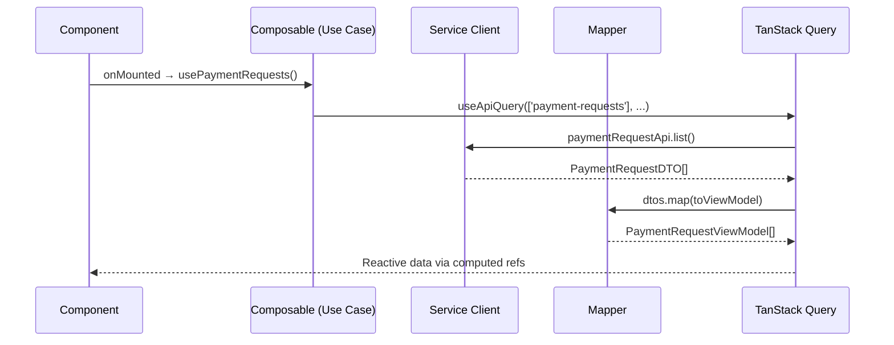

# State Management Architecture

> **Parent:** [Frontend Architecture](ARCHITECTURE.md)
> **Technology:** Pinia (Client State) + TanStack Query (Server State)

---

## 1. Dual-State Philosophy

We distinguish between two types of state to ensure high performance and reliability:

1.  **Server State (TanStack Query)**: **The Source of Truth** for all domain data (e.g., Accounts, Payment Requests). It manages the cache lifecycle, background refetching, and API synchronization.
2.  **Client State (Pinia)**: **Ephemeral UI State** (e.g., "is sidebar open", "active tab") or **Global Context** (e.g., "current session", "permissions").

### 1.1 The "Query-First" Rule

Domain data (entities fetched from the API) must **never** be manually duplicated into a Pinia store unless there is a specific requirement for complex cross-component optimistic mutations that TanStack Query cannot handle (extremely rare in an ERP).

- **Use TanStack Query** for: List data, Single records, Paginated results.
- **Use Pinia** for: Sidebar toggles, Command palette visibility, Local form drafts, App density settings.

---

## 2. Store Anatomy

### 2.1 UI State Store Template (The Ephemeral Local)

```typescript
// modules/business/finance/ledger/ui/stores/ledger-ui.store.ts
import { defineStore } from 'pinia'
import { ref } from 'vue'

export const useLedgerUIStore = defineStore('ledger-ui', () => {
  const isFilterVisible = ref(false)
  const activeView = ref<'grid' | 'cards'>('grid')
  const selectedAccountId = ref<string | null>(null)

  function toggleFilters() {
    isFilterVisible.value = !isFilterVisible.value
  }

  function $reset() {
    isFilterVisible.value = false
    activeView.value = 'grid'
    selectedAccountId.value = null
  }

  return { isFilterVisible, activeView, selectedAccountId, toggleFilters, $reset }
})
```

### 2.2 Key Rules

- **Setup Store syntax** (function-based) over Options API for full TypeScript inference.
- **Stores hold ViewModels**, not raw DTOs. The mapper transforms data before it enters the store.
- **No API calls in stores**. Stores are passive state containers. Composables orchestrate data flow.
- **Always expose `$reset()`** for logout cleanup and testing.

---

## 3. Data Flow: API → Store → Component



### 3.1 Composable with TanStack Query

```typescript
// modules/business/finance/ap/payment-requests/application/composables/usePaymentRequests.ts
import { useQuery } from '@tanstack/vue-query'
import { paymentRequestAdapter } from '../infrastructure/payment_request_adapter'
import { mapPaymentRequest } from '../infrastructure/payment_request.mapper'

export function usePaymentRequests() {
  const {
    data: requests,
    isLoading,
    error,
  } = useQuery({
    queryKey: ['payment-requests'],
    queryFn: async () => {
      const dtos = await paymentRequestAdapter.list()
      return dtos.map(mapPaymentRequest)
    },
  })

  return { requests, isLoading, error }
}
```

---

## 4. Cross-Module Reactivity via Event Bus

Stores **never** import other stores. When Module A's action should refresh Module B's data, use the Event Bus:

```typescript
// modules/payment-requests/composables/usePayRequest.ts
import { eventBus } from '@/core/event-bus/event-bus'

export function usePayRequest() {
  async function payRequest(id: string, dto: PayRequestDTO) {
    const result = await paymentRequestApi.pay(id, dto)
    store.updateRequest(toViewModel(result))

    // Notify other modules without importing them
    eventBus.emit('payment-request:paid', {
      id: result.id,
      amount: Money.from(result.amount, result.currency),
    })
  }

  return { payRequest }
}

// modules/business/finance/ledger/application/composables/useLedgerAccounts.ts
// Subscribes to the event — refreshes its own caches
eventBus.on('payment-request:paid', () => {
  queryClient.invalidateQueries(['ledger-accounts'])
})
```

---

## 5. Optimistic Updates Pattern

For actions that should feel instant (like submitting a request), use TanStack Query's built-in `onMutate` / `onError` mechanism. This keeps domain data inside the query cache — consistent with the **Query-First** rule (§1). Never duplicate server state into a Pinia store for optimistic updates.

```typescript
// modules/business/finance/ap/payment-requests/application/composables/useSubmitRequest.ts
import { useMutation, useQueryClient } from '@tanstack/vue-query'
import { paymentRequestAdapter } from '../../infrastructure/payment_request_adapter'
import type { PaymentRequest } from '../../domain/payment-request.types'

export function useSubmitRequest() {
  const queryClient = useQueryClient()

  return useMutation({
    mutationFn: (id: string) => paymentRequestAdapter.submit(id),

    // 1. Optimistic update — modify cache BEFORE server responds
    onMutate: async (id: string) => {
      // Cancel in-flight queries to avoid overwriting our optimistic data
      await queryClient.cancelQueries({ queryKey: ['payment-requests'] })

      // Snapshot the previous cache for rollback
      const previous = queryClient.getQueryData<PaymentRequest[]>(['payment-requests'])

      // Optimistically update the cached list
      queryClient.setQueryData<PaymentRequest[]>(['payment-requests'], (old) =>
        (old ?? []).map((pr) =>
          pr.id === id ? { ...pr, status: 'SUBMITTED' as const } : pr,
        ),
      )

      return { previous }
    },

    // 2. Rollback on failure — restore the snapshot
    onError: (_err, _id, context) => {
      if (context?.previous) {
        queryClient.setQueryData(['payment-requests'], context.previous)
      }
    },

    // 3. Always refetch after mutation settles (success or error)
    onSettled: () => {
      void queryClient.invalidateQueries({ queryKey: ['payment-requests'] })
    },
  })
}
```

> **Key Principle:** The query cache IS the state. Pinia stores must never hold domain data, even temporarily for optimistic updates.

---

## 6. Auth Store (Shared Cross-Cutting Concern)

The auth store is the **only** store in `core/`. It holds identity state consumed by all modules:

```typescript
// core/auth/auth.store.ts
export const useAuthStore = defineStore('auth', () => {
  const token = ref<string | null>(null)
  const currentUser = ref<CurrentUser | null>(null)
  const currentTenant = ref<TenantInfo | null>(null)

  const isAuthenticated = computed(() => !!token.value)
  const tenantFeatures = computed(() => currentTenant.value?.features ?? {})

  function hasFeature(feature: string): boolean {
    return tenantFeatures.value[feature] === true
  }

  return {
    token,
    currentUser,
    currentTenant,
    isAuthenticated,
    tenantFeatures,
    hasFeature,
  }
})
```

This store is not a bounded context — it's infrastructure that enables module isolation by providing identity context to route guards and API interceptors.
